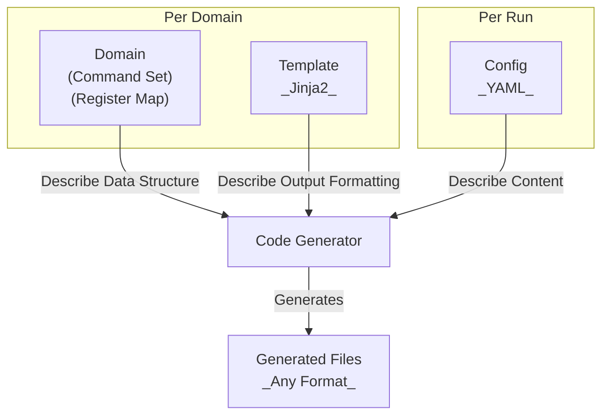

<h1 align=center><code>embgen</code></h1>

<div align="center">
  <image src="banner_simple.svg" alt="embgen banner" width="400px"/>
</div>

[](https://github.com/CedricHirschi/embgen/actions/workflows/test.yml)

---

## Overview

**embgen** is a unified code generator for embedded systems that generates code from YAML definitions.

### Example Use Cases

**Embedded Device Commands:** Imagine you have an embedded device that communicates with a host computer using a custom command protocol. You can define the commands in a YAML file and use embgen to generate C header files for the device firmware and Python code for the host application.

**Hardware Register Maps:** Define hardware register layouts in YAML and generate C headers for firmware, Python classes for testing, and Markdown documentation for reference.

_Why should this be useful?_ One simple reason: Single Source of Truth. By defining your commands or registers in a single YAML file, you can automatically generate consistent code and documentation across multiple languages, formats and versions, reducing errors and saving development time.

### Design Philosophy

This package is designed with a modular architecture that allows easy extension through custom domains and templates.

You can think of a Domain as a plugin that knows how to interpret a specific type of YAML definition (e.g., command protocols, register maps) and generate code in various formats (C headers, Python, Markdown, etc.) using Jinja2 templates.



## Features

- **Plugin-based architecture** — Add new domains by creating a single directory
- **Auto-discovery** — CLI automatically discovers available domains
- **Auto-detection** — Automatically detect domain from YAML content
- **Multiple output formats** — Generate C headers, Python, Markdown documentation, and more
- **Template-based** — Uses Jinja2 templates for flexible output customization
- **Extensible** — Create custom domains for your specific code generation needs

## Quick Start

### Installation

```bash
# Using uv (recommended)
uv sync

# Or with pip
pip install -e .
```

### Generate Code

```bash
# Generate C header from a commands definition
embgen commands config.yml -o output/ --h

# Generate multiple formats at once
embgen commands config.yml -o output/ --h --py --md

# Auto-detect the domain type
embgen auto config.yml -o output/ --h
```

## Built-in Domains

embgen ships with two built-in domains:

| Domain                            | Description                  | Output Formats             |
| --------------------------------- | ---------------------------- | -------------------------- |
| [Commands](domains/commands.md)   | Command protocol definitions | C Header, Python, Markdown |
| [Registers](domains/registers.md) | Hardware register maps       | C Header, Python, Markdown |

## Documentation

- [CLI Usage](usage/cli.md) — Complete command-line reference
- [Python API](usage/python-api.md) — Using embgen as a library
- [Built-in Domains](domains/index.md) — Commands and Registers documentation
- [Creating Domains](extending/index.md) — How to create custom domains
- [Architecture](architecture/architecture.md) — Internal design and module structure
