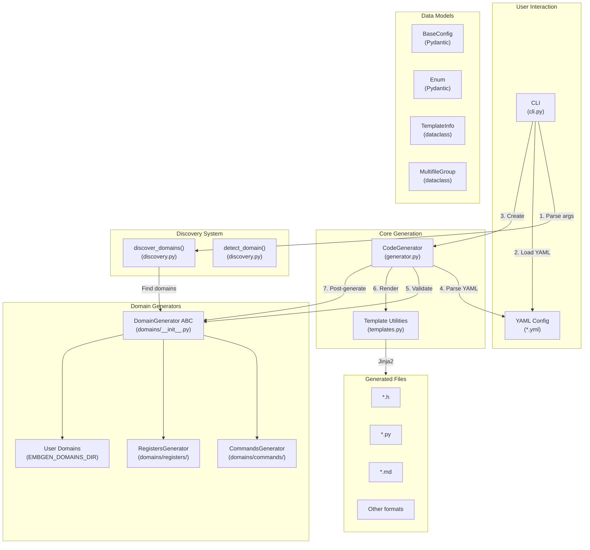
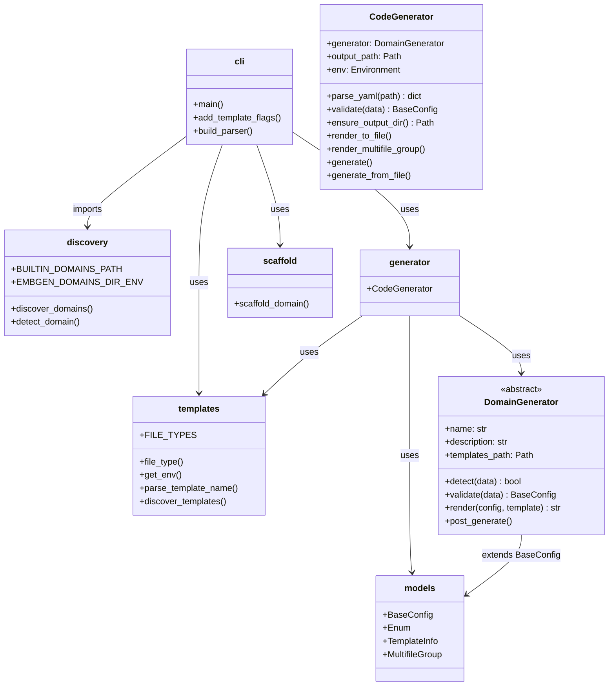
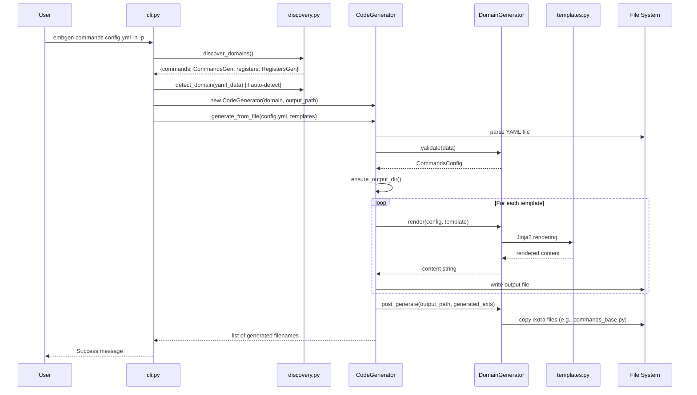
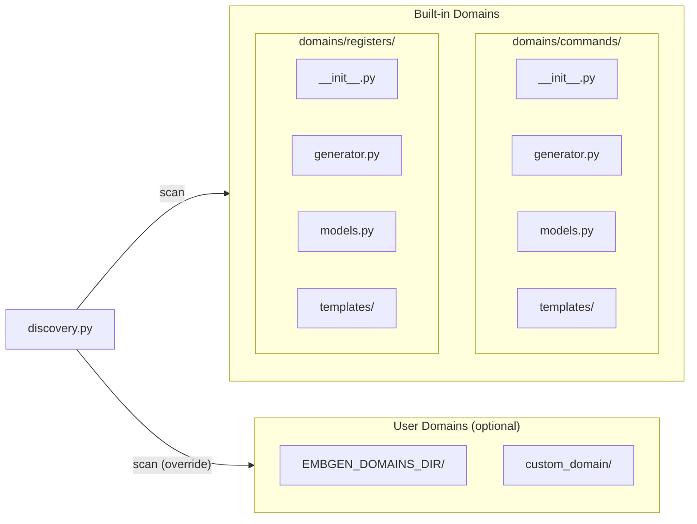
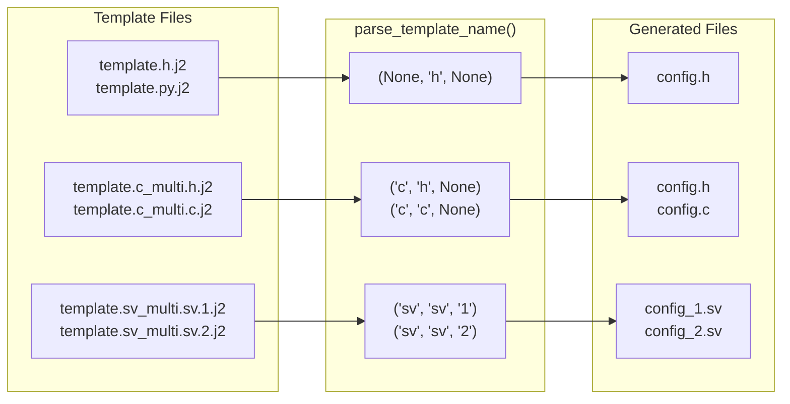

# embgen Architecture

This document describes the architecture and module structure of the embgen package.

## Package Overview

## Module Responsibilities

## Generation Flow

## Domain Structure

## Multifile Template Support

## Key Design Patterns

1. **Abstract Factory**: `DomainGenerator` ABC defines the interface, concrete implementations (CommandsGenerator, RegistersGenerator) are discovered dynamically.

2. **Strategy Pattern**: Each domain implements its own validation and rendering strategy.

3. **Plugin Architecture**: User domains can be added via `EMBGEN_DOMAINS_DIR` environment variable without modifying core code.

4. **Separation of Concerns**:
   - `discovery.py`: Finding and loading domains
   - `generator.py`: Orchestrating the generation workflow
   - `templates.py`: Template utilities and parsing
   - `models.py`: Shared data structures
   - `cli.py`: Command-line interface only
